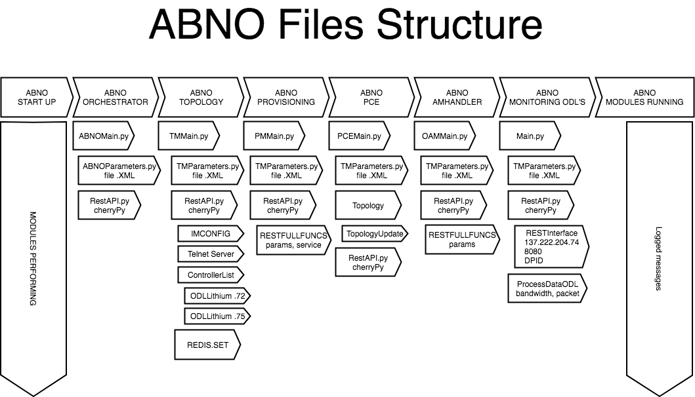

# ABNO-Based network orchestration of end-to-end Multi-layer 

ABNO architecture that are the multi-domain and multi-layer network orchestration considered in this paper.

The ABNO controller runs the workflows and can interwork with the different blocks. The Topology Server recovers the topology exposed by each SDN/OpenFlow controller’s North-Bound Interface (NBI) or the BGP-LS speaker of the GMPLS/PCE domain. The PCE handles the path computation across the network graph provided by the Topology y Server and it has been extended to deal with OpenFlow datapath identifiers. The Provisioning Manager is responsible for the actua l flow establishment request to the OpenFlow controllers through each specific controller’s NBI, and to the active stateful PCE of the GMPLS domains. The Flow server is responsible for storing the state of the provisioned flows. Finally, the virtual network topology manager (VNTM) is responsible to coordinate in multi-layer networks the layered establishment of server connnections (i.e., OCS) and its promotion as logic cal link in the client layer (i.e., OPS).

## Open Source Licence
Apache 2.0

https://www.apache.org/licenses/LICENSE-2.0

